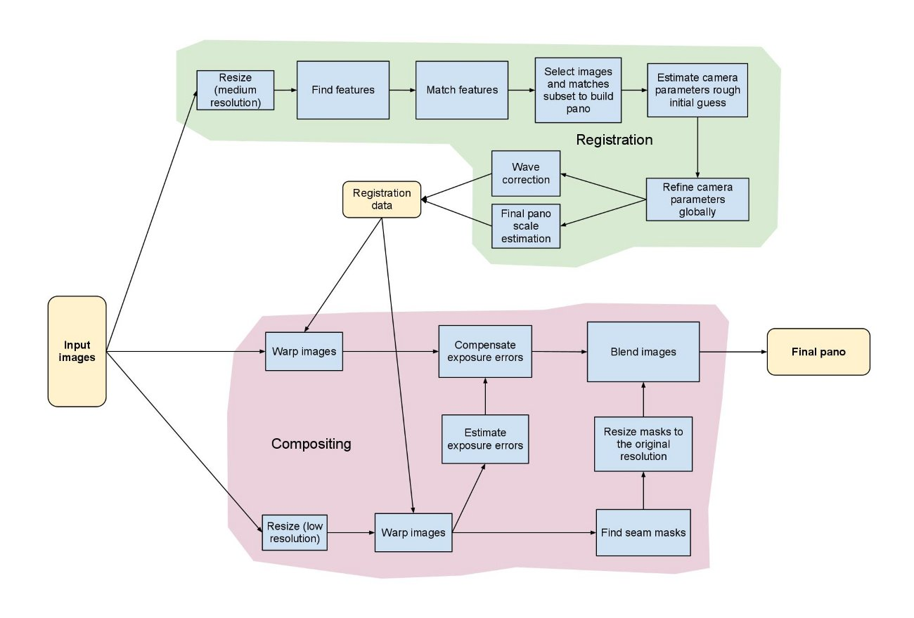
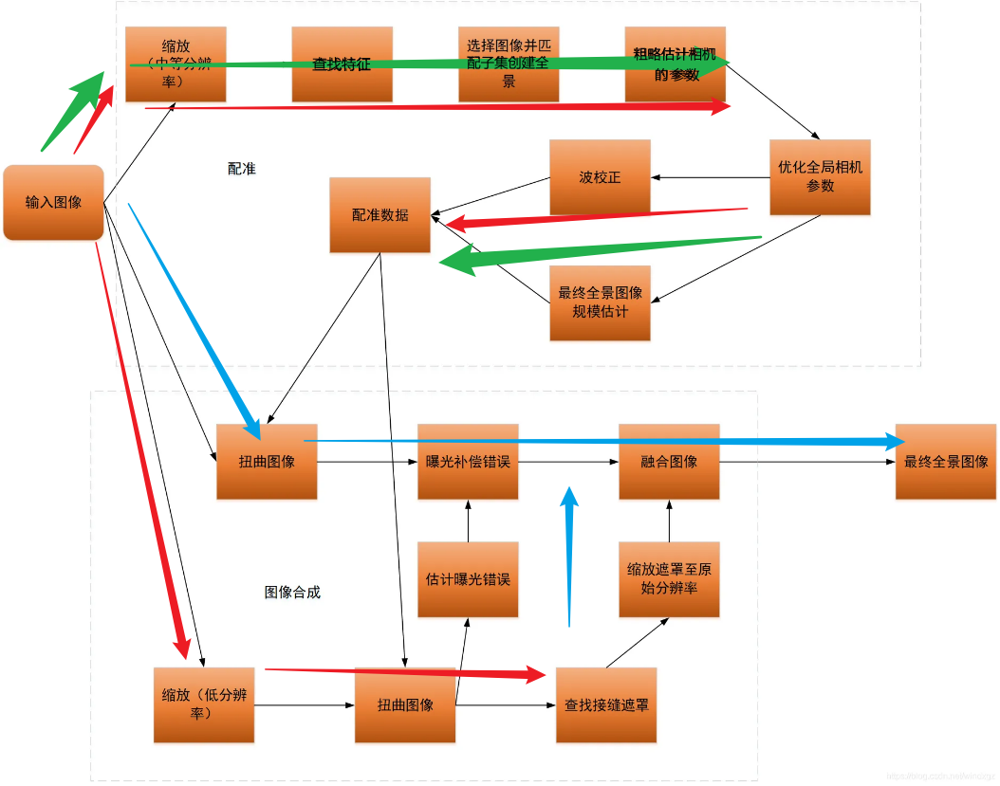

> 这是一篇关于 `stitching_detailed.py` 的学习笔记, 暂时主要记录一下如何从最后的拼接是如何进行的, 以及我需要保存一些什么样的数据, 来为我其它相同机位的图片的实时拼接提供帮助

<!-- more -->

## 写在前面的话

本来这篇 blog 我预计是在 10.27 的时候写出来的, 但是代码在调试的时候, 一直报错, 所以一直在找 bug (还是太菜了 悲), 所以最后只能到今天来写了, 由于网上已经有大量的关于代码的解读, 虽然大多为 cpp 的代码解读, 但其实 py 写出来的逻辑和 cpp 的大差不差

具体的代码获取可以到 [官方文档](https://docs.opencv.org/4.x/d8/d19/tutorial_stitcher.html) 里获取 (发现一份简单的源码要看 10 天, 好恐怖...)

## 为什么要 RTFSC

在最开始的时候, 我曾经尝试使用 [计算机视觉方向简介  图像拼接 stitch 算法 - CSDN 博客](https://blog.csdn.net/cy413026/article/details/133953281) 里提到的方法, 先计算出单应矩阵 **H** , 然后根据矩阵对图片进行变形和融合, 但是对于自己拍摄的图片进行融合之后发现效果非常不好, 于是使用了 opencv 提供的高级封装类 `cv::Stitcher` 对图片进行拼接, 发现效果非常好, 但是实际上放到视频流的时候, 发现对于实时的两张图片进行拼接的时候有两个问题: 

1. 速度特别慢, 拼接出来的视频流的实时性不能得到保证
2. 拼接出来的图片尺寸一直在变, 视频流时大时小的

于是希望能对 `cv::Stitcher` 的实现细节有更深刻的理解, 看能不能固定一些参数, 从而提高拼接速度, 固定拼接尺寸. 上面提到的官方文档主要是对 `cv::Stitcher` 这个高层次的封装类的使用说明, 官网也说了, "如果想研究缝合流水线的内部结构或者你想试验详细的配置, 你可以使用 C++ 或者 python 中的缝合详细的源代码"

## stitch 流程简介

据说官方给出的拼接流程如下图所示 (不过我也是在别人的 blog 里扒出来的)



可以看出配准和融合是的尺度是不同的, 并且对相机的参数进行了两次的优化, 并没有使用 `findHomography` 这个函数获得单应矩阵, 而是通过相机的方式进行投影变换[^1]

这个程序的第一步是导入各种设定的参数 (也就是读取 `args` 部分), 所以一开始我们需要知道这些参数是干什么的, 就拿官网给出的 [参数](https://docs.opencv.org/4.x/d8/d19/tutorial_stitcher.html#:~:text=boat5.jpg%20boat2.jpg%20boat3.jpg%20boat4.jpg%20boat1.jpg%20boat6.jpg%20%E2%80%93work_megapix%200.6%20%E2%80%93features%20orb%20%E2%80%93matcher%20homography%20%E2%80%93estimator%20homography%20%E2%80%93match_conf%200.3%20%E2%80%93conf_thresh%200.3%20%E2%80%93ba%20ray%20%E2%80%93ba_refine_mask%20xxxxx%20%E2%80%93save_graph%20test.txt%20%E2%80%93wave_correct%20no%20%E2%80%93warp%20fisheye%20%E2%80%93blend%20multiband%20%E2%80%93expos_comp%20no%20%E2%80%93seam%20gc_colorgrad) 来讲

```bash
boat5.jpg boat2.jpg boat3.jpg boat4.jpg boat1.jpg boat6.jpg \
–work_megapix 0.6 \
–features orb \
–matcher homography \
–estimator homography \
–match_conf 0.3 \
–conf_thresh 0.3 \
–ba ray \
–ba_refine_mask xxxxx \
–save_graph test.txt \
–wave_correct no \
–warp fisheye \
–blend multiband \
–expos_comp no \
–seam gc_colorgrad
```

这里部分参数的含义如下[^2]

> - work_megapix ：在特征提取等 registration 过程中，为了减小耗时，会将图像进行缩放，这就需要一个缩放比例；
> - features : 表示选用的提取的特征，（`SURF | ORB | SIFT | akaze`）
> - matcher : 特征匹配方法，（`homography | affine`）, 单应性变换与仿射变换方法，分别对应 BestOf2NearestMatcher, AffineBestOf2NearestMatcher，后者会找到两幅图仿射变换的最佳匹配点；
> - estimator : （`homography | affine`）, 相机参数评估方法；
> - match_conf : 浮点型数据，表示匹配阶段内点判断的阈值；
> - conf_thresh : 两幅图片是来自同一全景的阈值：
> - ba : BA 优化相机参数的代价函数，（`no | reproj | ray | affine`）;
> - ba_refine_mask : BA 优化的时候，可以固定某些参数不动，通过指定 mask 实现。`x`表示需要优化，`_`表示固定参数，对应的顺序是 fx, skew, ppx, aspect, ppy；
> - wave_correct : 波形矫正标志，有（`no | horiz | vert`）三种类型，可以将拼接图像约束在水平方向，或者垂直方向，避免出现 “大鹏展翅” 的情况；​
> - save_graph : 以 DOT 语言格式保存图像之间的匹配关系；

> - warp ： 图像变换方法，包括球面投影、柱面投影等，opencv 支持的投影方法比较多；
> - seam_megapix : 寻找拼接缝的时候，会将图像进行缩放，此参数与 work_scale 可以用来控制缩放比例；
> - seam : 接缝寻找的方法；
> - compose_megapix : 预览时用于设置拼接过程中以及拼接图的分辨率；
> - expos_comp : 光照补偿方法；
> - blend : 图像融合方法，常用的有（`feather | multibend`）；

其实一开始看这么多参数也是懵的, 但是我们可以根据输入的参数, 先替换程序里参数对应的部分, 这里我贴出我的部分修改: 

```python
def main():
    # args = parser.parse_args()
    # img_names = args.img_names
    img_names = ['pictures_double/cam_ed_1/0001.jpg', 'pictures_double/cam_ed_2/0001.jpg']
    # img_names = ['A_fish.jpg', 'B_fish.jpg']
    print(img_names)
    # work_megapix = args.work_megapix
    work_megapix = 0.6  # default
    # seam_megapix = args.seam_megapix
    seam_megapix = 0.1  # default
    # compose_megapix = args.compose_megapix
    compose_megapix = -1  # default
    # conf_thresh = args.conf_thresh
    conf_thresh = 0.3
    # ba_refine_mask = args.ba_refine_mask
    ba_refine_mask = 'xxxxx'
    # wave_correct = WAVE_CORRECT_CHOICES[args.wave_correct]
    wave_correct = None
    # if args.save_graph is None:
    #     save_graph = False
    # else:
    #     save_graph = True
    save_graph = True
    # warp_type = args.warp
    warp_type = 'plane'
    # warp_type = 'fisheye'
    # blend_type = args.blend
    blend_type = 'multiband'  # 后面的blend选择会用上
    # blend_strength = args.blend_strength
    blend_strength = 5  # default
    # result_name = args.output
    result_name = 'result.jpg'  # default
    # if args.timelapse is not None:
    #     timelapse = True
    #     if args.timelapse == "as_is":
    #         timelapse_type = cv.detail.Timelapser_AS_IS
    #     elif args.timelapse == "crop":
    #         timelapse_type = cv.detail.Timelapser_CROP
    #     else:
    #         print("Bad timelapse method")
    #         exit()
    # else:
    #     timelapse = False
    timelapse_type = None
    timelapse = False
    # finder = FEATURES_FIND_CHOICES[args.features]() # 这里写的是图像匹配的特征类型, 默认为 surf 但是其实可以使用其它的东西
    finder = cv.ORB.create()
    seam_work_aspect = 1
    full_img_sizes = []  # 用于存放原始图片的尺寸
    features = []  # 用于存放特征, 这个特征是在work scale下的特征
    images = []  # 这里的图片是seam scale下的图片 (缝隙尺寸是啥)
    is_work_scale_set = False
    is_seam_scale_set = False
    is_compose_scale_set = False
```

就我个人对代码的阅读, 这个 `stitching_detail` 总共分为两个大的步骤: 

1. 在 work_scale(中等分辨率) 下, 对图片进行处理, 目的是得到图片的 feature(特征), 通过对多张图片之间的 features 进行 match(匹配) 从而得到各个图片之间的关系, 然后对图片进行 subset(子集), 筛选出有足够多特征进行拼接的图片, 基于这些图片进行 camera(相机) 参数的估计和优化. 同时在 seam_scale(低分辨率) 下, 对图片进行 warp(扭曲), 得到 masks(接缝遮罩) 和 compensator(曝光错误). 这一块对应着下图的**红色箭头**的部分
2. 在 compose_scale(一般情况就是原图) 下, 对图片进行 warp (扭曲), compensator.feed(曝光补偿), 根据 mask(遮罩) 进行 blender.feed(融合). 这一块对应着下图的**蓝色箭头**的部分



## 保存必要参数

我的想法, 是将得到图片配准数据的部分 (也就是**绿色箭头**的部分), 提前计算出来, 然后保存起来, 之后在用的时候, 直接读取这一部分的数据

而绿色部分做的工作主要是计算配准数据, 其实这个配准数据最后得到的是优化后的相机参数 `cameras` , 可以看到, 前面所作的工作包括查找特征, 筛选子集, 目的都是后面的估计相机参数, 然后根据指定的优化器对相机的参数进行优化 (此时计算出来的相机参数都是在 work_scale 下计算得到的, 在后期使用的时候这个参数要根据需求放缩到 seam_seale 下, 或是 compose_scale 下)

### `cameras` 参数解析

发现得到的相机参数不能直接保存下来, 使用 pickle 直接保存会报错

通过查询 opencv 官方的文档, 可以知道得到的相机参数是一个 `cv::detail::CameraParams` 结构体, 具体可以参考 [官方链接](https://docs.opencv.ac.cn/4.10.0/d4/d0a/structcv_1_1detail_1_1CameraParams.html). 虽然链接里给的是 cpp 的实现, 其实 python 的实现是类似的, 可以看到这个结构体有一些关键的参数如: `focal`, `ppx`, `ppy`, `R` 等, 还有一个函数 `K()` , 但是这个函数没有具体的实现, 只知道会得到一个 `Mat` 类型的矩阵

通过对这个矩阵的分析, 发现在 python 里其实这个矩阵得到的是一个 `3*3` 的数组, 具体的值如下所示: 

```shell
+-------+-------+-------+
| focal |   0   |  ppx  |
+-------+-------+-------+
|   0   | focal |  ppy  |
+-------+-------+-------+
|   0   |   0   |   1   |
+-------+-------+-------+
```

所以可以根据上述信息, 我希望构建一个简单的结构来保存得到的相机参数

### `MyCamera` 类的构建

具体的构建如下: 

```python
import numpy as np


class MyCamera:
    def __init__(self, R, focal, ppx, ppy):
        self.R = R
        self.focal = focal
        self.ppx = ppx
        self.ppy = ppy

    def K(self):
        K = np.array([[self.focal, 0         , self.ppx],
                      [0         , self.focal, self.ppy],
                      [0         , 0         , 1]])
        return K

```

## 数据的保存和使用

此时得到的相机数据可以先保存到自定义的类里, 然后使用 pickle 保存

```python
my_cameras = []
for i in range(0, 2):
    R = cameras[i].R
    focal = cameras[i].focal
    ppx = cameras[i].ppx
    ppy = cameras[i].ppy
    my_cameras.append(MyCamera(R, focal, ppx, ppy))

with open('camera_params_list.pkl', 'wb') as f:
    pickle.dump(my_cameras, f)
```

在使用数据的时候

```python
with open('camera_params_list.pkl', 'rb') as f:
    cameras = pickle.load(f)
```

在具体使用数据的时候根据上面的图可知, 此时需要做两大工作, 一部分是在 seam_scale 下 warp 图像, 得到 compensator(曝光补偿参数) 和 masks_warped(接缝遮罩), 还有一部分是在 compose_scale 下 warp 图像, 进行曝光补偿, 初始化 blender(融合器), 将遮罩放大到compose_scale, 最后将 images_warped_f_compose 和 masks_warped_compose 传入blender 里, 进行最后的拼接

关于使用参数可以参考一下代码: 

```python
def use_args(images, num_images, warp_type, work_scale, seam_scale, compose_scale, cameras):
    focals = []
    for cam in cameras:
        focals.append(cam.focal)
    focals.sort()
    if len(focals) % 2 == 1:  # 奇数张图片
        warped_image_scale = focals[len(focals) // 2]
    else:  # 偶数张图片
        warped_image_scale = (focals[len(focals) // 2] + focals[len(focals) // 2 - 1]) / 2  # 取中间两个值的平均

    seam_work_aspect = seam_scale / work_scale
    compose_work_aspect = compose_scale / work_scale

    warper_seam = cv.PyRotationWarper(warp_type, warped_image_scale * seam_work_aspect)
    corners_seam = []
    masks_warped_seam = []  # 扭曲后的mask
    images_warped_seam = []
    images_warped_f_seam = []
    for idx in range(0, num_images):
        # 调整内参矩阵
        img_seam = cv.resize(src=images[idx], dsize=None, fx=seam_scale, fy=seam_scale,
                             interpolation=cv.INTER_LINEAR_EXACT)
        K = cameras[idx].K().astype(np.float32)
        swa = seam_work_aspect
        K[0, 0] *= swa
        K[0, 2] *= swa
        K[1, 1] *= swa
        K[1, 2] *= swa
        # 通过内参矩阵计算出 corner 和 warp 之后的 image
        # corner, image_wp = warper_seam.warp(images[idx], K, cameras[idx].R, cv.INTER_LINEAR, cv.BORDER_REFLECT)
        corner, image_wp = warper_seam.warp(img_seam, K, cameras[idx].R, cv.INTER_LINEAR, cv.BORDER_REFLECT)
        corners_seam.append(corner)
        images_warped_seam.append(image_wp)
        images_warped_f_seam.append(image_wp.astype(np.float32))
        # 通过内参矩阵计算出 p 和 warp 之后的 mask
        # mask_seam = cv.UMat(255 * np.ones((images[idx].shape[0], images[idx].shape[1]), np.uint8))
        mask_seam = cv.UMat(255 * np.ones((img_seam.shape[0], img_seam.shape[1]), np.uint8))
        p, mask_wp = warper_seam.warp(mask_seam, K, cameras[idx].R, cv.INTER_NEAREST, cv.BORDER_CONSTANT)
        masks_warped_seam.append(mask_wp.get())

    expos_comp_type = cv.detail.ExposureCompensator_NO
    compensator = cv.detail.ExposureCompensator_createDefault(expos_comp_type)
    # 曝光补偿错误
    compensator.feed(corners=corners_seam, images=images_warped_seam, masks=masks_warped_seam)

    seam_finder = cv.detail_GraphCutSeamFinder('COST_COLOR_GRAD')
    # 找到接缝遮罩
    masks_warped = seam_finder.find(images_warped_f_seam, corners_seam, masks_warped_seam)  # (这一句运行的特别慢!!!)
    # masks_warped_0 = masks_warped[0].get()

    warper_compose = cv.PyRotationWarper(warp_type, warped_image_scale * compose_work_aspect)  # 这个用于后面的变换
    compose_scale = 1
    corners_compose = []
    sizes_compose = []
    blender = None

    images_warped_f_compose = []
    masks_warped_compose = []

    for idx in range(0, num_images):
        img = images[idx]
        # cameras[idx].focal *= compose_work_aspect
        # cameras[idx].ppx *= compose_work_aspect
        # cameras[idx].ppy *= compose_work_aspect
        sz = (int(round(img.shape[1] * compose_scale)),  # 这里的size是反的
              int(round(img.shape[0] * compose_scale)))
        cwa = compose_work_aspect
        K = cameras[idx].K().astype(np.float32)
        K[0, 0] *= cwa
        K[0, 2] *= cwa
        K[1, 1] *= cwa
        K[1, 2] *= cwa
        roi = warper_compose.warpRoi(sz, K, cameras[idx].R)
        corners_compose.append(roi[0:2])
        sizes_compose.append(roi[2:4])
        corner, image_warped = warper_compose.warp(img, K, cameras[idx].R, cv.INTER_LINEAR, cv.BORDER_REFLECT)
        mask = 255 * np.ones((img.shape[0], img.shape[1]), np.uint8)
        p, mask_warped = warper_compose.warp(mask, K, cameras[idx].R, cv.INTER_NEAREST, cv.BORDER_CONSTANT)
        compensator.apply(idx, corners_compose[idx], image_warped, mask_warped)
        images_warped_f_compose.append(image_warped.astype(np.int16))

        dilated_mask = cv.dilate(masks_warped[idx], None)  # 膨胀掩码
        seam_mask = cv.resize(dilated_mask, (mask_warped.shape[1], mask_warped.shape[0]), 0, 0,
                              cv.INTER_LINEAR_EXACT)  # 调整大小
        mask_warped = cv.bitwise_and(seam_mask, mask_warped)  # 按位与操作
        masks_warped_compose.append(mask_warped)

    if blender is None:
        blend_strength = 5  # default
        dst_sz = cv.detail.resultRoi(corners=corners_compose, sizes=sizes_compose)
        blend_width = np.sqrt(dst_sz[2] * dst_sz[3]) * blend_strength / 100
        blender = cv.detail_MultiBandBlender()
        blender.setNumBands((np.log(blend_width) / np.log(2.) - 1.).astype(np.int32))
        blender.prepare(dst_sz)

    for idx in range(0, num_images):
        blender.feed(cv.UMat(images_warped_f_compose[idx]), masks_warped_compose[idx], corners_compose[idx])

    result = None
    result_mask = None
    result, result_mask = blender.blend(result, result_mask)
    # cv.imwrite('result.jpg', result)
    zoom_x = 600.0 / result.shape[1]
    dst = cv.normalize(src=result, dst=None, alpha=255., norm_type=cv.NORM_MINMAX, dtype=cv.CV_8U)
    dst = cv.resize(dst, dsize=None, fx=zoom_x, fy=zoom_x)
    # cv.imshow('result', dst)
    # cv.waitKey()
    return dst
```

## 参考文献

[^1]: [https://blog.csdn.net/windxgz/article/details/108199036](https://blog.csdn.net/windxgz/article/details/108199036)

[^2]: [https://www.cnblogs.com/wangnb/p/15836148.html](https://www.cnblogs.com/wangnb/p/15836148.html)
