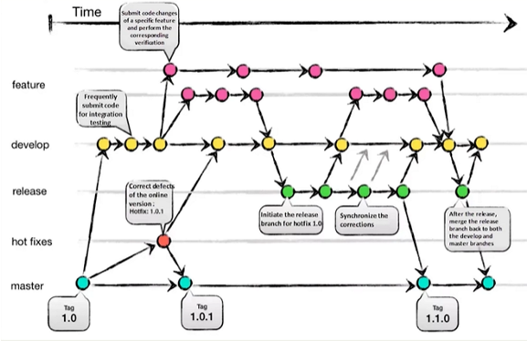
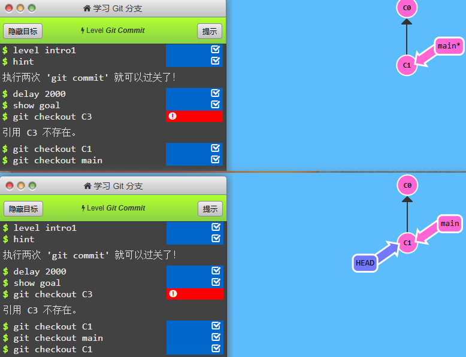

> 这是一篇关于学习 [The Missing Semester of Your CS Education 中文版](https://missing-semester-cn.github.io/) 前六课笔记的一个简单的汇总, 包含了许多之前接触过但是可能没有在意的 Linux 系统使用细节, 包含 Shell 函数的编写, 正则表达式, Git 的底层原理等

<!-- more -->

## L1 课程概览与 shell

> Shell 是一种用户界面, 它让用户可以与操作系统的内核进行交互. Shell 接受用户的命令, 然后将这些命令传递给操作系统去执行, 并将结果返回给用户. 它可以是图形化的 (GUI), 也可以是基于文本的 (CLI). 在 Unix, Linux 和 macOS 等类 Unix 系统中, Shell 通常指的是命令行解释器或终端
> bash 是 shell 的一种具体实现

### shell 的输入输出流

在 shell 中, 程序有两个主要的“流”: 输入流和输出流(这里和 cpp 里的输入输出有一点类似)

`echo` 命令是 shell 里的返回(return), 打印(print)类似的一个命令: 

```shell
# 比如在命令行里输入
echo hello
# 回车之后, 就会在命令行里打印一句
hello
```

在上面的例子里, 输入流是 `echo` 后面跟着的 hello, 输出流是回车(enter)之后, 终端打印的 hello

我们可以使用 `< file` 和 `> file` 这两个命令, 将程序的输入输出流分别重定向到文件: 

输出流比较好理解: 

```shell
# 运行下述 cmd
echo hello > hello.txt
# 可以得到将 hello 输入到 hello.txt 文件里的效果
# 因为本来 echo 的输出流就是 hello, 不过本来是要输出到命令行里的
# 此时在重定向之后, 输出到 hello.txt 这个文件里了
```

重点理解一下输入流: 

```shell
# 看看下述两个命令
cat hello.txt
cat < hello.txt
# 这两个的输出结果其实是一样的
```

但是上述两个输入的原理是不一样的, 第一个是将 `hello.txt` 作为参数传递给 cat, cat 需要自己去读取 `hello.txt` 文件的内容, 然后打印到命令行, 第二个是将 `hello.txt` 文件里的内容直接当作 cat 的标准输入流传递给 cat

### shell 的 shebang

shebang 是 shell 脚本开头处的一个特殊的注释: `#!`

在这个注释的后面跟的是当前脚本执行程序的路径, 常见的有

```shell
#! /bin/sh
#! /bin/bash
#! /your_python_path/python
```

一般而言, 一个 shell 脚本的前面需要跟一个执行的软件(解释器), 但是如果 shell 脚本的第一行有 shebang 的话, 系统可以自己去寻找解释器

## L2 Shell 工具和脚本

在 bash 里, 变量的赋值的语法是 `foo=bar` 这里是没有空格的, 在 bash 里空格有很特别的意义

定义一个 bash 函数可以像如下方式: (可以看成是一些 bash 命令的集合)

```bash
# 定义  
mcd () {
    mkdir -p "$1"
    cd "$1"
}
```

这里的 `$1` 表示传递给脚本的第一个参数: 

```bash
# 使用 mcd
mcd test_folder
# 此时在函数内的 $1 就是 'test_folder' 这个字符串
```

在 bash 脚本里, `$` 的意义是变量取值(有一点 return 的感觉), 具体例子: 

```bash
# 键入
foo=bar
echo $foo
# 此时会打印出
bar
```

在 bash 脚本里 `'(单引号)` 和 `"(双引号)`  是有细微的差别的(双引号 `" "` 里面如果出现了 `$` 则会在使用的时候, 自动将 `$` 部分变成它的值)

```bash
foo=bar
echo "$foo"
# 打印 bar
echo '$foo'
# 打印 $foo
```

bash 使用了很多特殊的变量来表示参数, 错误代码和相关变量, 下面是其中一部分[^1]: 

```bash
- `$0` - 脚本名
- `$1` 到 `$9` - 脚本的参数。 `$1` 是第一个参数，依此类推。
- `$@` - 所有参数
- `$#` - 参数个数
- `$?` - 前一个命令的返回值
- `$$` - 当前脚本的进程识别码
- `!!` - 完整的上一条命令，包括参数。常见应用：当你因为权限不足执行命令失败时，可以使用 `sudo !!` 再尝试一次。
- `$_` - 上一条命令的最后一个参数。如果你正在使用的是交互式 shell，你可以通过按下 `Esc` 之后键入 . 来获取这个值。
```

如果你希望在 bash 脚本里获取某个命令的结果, 可以使用 `$(your_cmd)` 的方式: 

```bash
#! /bin/sh 
marco () {
  pwd > /tmp/missing/marco.data
}
polo () {
  work=$(cat /tmp/missing/marco.data)  # 看这里
  cd $work
}
```

## L3 编辑器 (Vim)

关于 vim 编辑器, 是一个非常丰富的一个部分, 感觉光写没用, 建议在编辑器里使用 `vimtutor` 命令, 快速上手 vim

> グッドラック

## L4 数据整理

这一节的重点是正则表达式, 可以去 [这个网址](https://regexone.com/) 快速上手

> GOOD LUCK

## L5 命令行环境

### tmux 的使用

此处埋个坑

### dotfiles(配置文件) 有关

linux 里的配置文件有很多, 一般都在你的 `~` 目录下, 而且一般都以 `.` 开头

于是有人希望把这些配置文件都集中到一个 `dotfiles/` 文件夹来使用 Git 集中管理, 这样如果你在一台新的 linux 系统里, 可以只花几分钟就可以完成自己熟悉的配置

基本原理是使用 "link" 的方式, 将原本应该出现文件的位置, 链接到 `dotfiles/` 文件夹下的对应的文件

(这里也先埋个坑)

## L6 版本控制(Git)

光知道如何使用命令行是没有用的, 就像下面那张图一样[^2]

​​

你只知道怎么使用命令行, 就像在使用魔法一样, 根本不知道底层在干些什么, 这很恐怖, 所以下面从底层介绍一下 **Git**

#### Git 数据的类型

Git 储存的最小单位是 `object`​, 它有<span data-type="text" style="background-color: var(--b3-card-error-background); color: var(--b3-card-error-color);">三种类型</span>: `blob`​, `tree`​, `commit`​

```cpp
// 文件就是一组数据
type blob = array<byte>

// 一个包含文件和目录的目录
type tree = map<string, tree | blob>

// 每个提交都包含一个父辈，元数据和顶层树
type commit = struct {
    parents: array<commit>
    author: string
    message: string
    snapshot: tree
}
```

一个 `blob`​ 就是一个<span data-type="text" style="background-color: var(--b3-card-error-background); color: var(--b3-card-error-color);">文件</span>, 里面存放的就是文本(本质就是一些char)

一个 `tree`​ 就是一个<span data-type="text" style="background-color: var(--b3-card-error-background); color: var(--b3-card-error-color);">文件夹</span>, 一个文件夹可以存放文件(blob)和其它文件夹(tree)

> 关于一个 `tree`​ 建立的是一个映射, 这个映射的 key 就是包含的文件或者文件夹的名字, 值是一个 `blob`​ 或者 `tree`​ 对象(当然实际上存的是这个对象的 hash 值)

一个 `commit`​ 是一个<span data-type="text" style="background-color: var(--b3-card-error-background); color: var(--b3-card-error-color);">提交</span>, 一个提交会包括上述的四个部分, 它依赖的提交(这里会出现多个提交是因为在 merge 的时候, 一个提交会依赖多个提交), 提交的作者, 提交的信息, 提交的时候 root 文件夹的状态

```shell
o <-- o <-- o <-- o <----  o 
            ^            /
             \          v
              --- o <-- o
```

> 每次新建一个 commit(提交) 的时候, 会涉及到多个 object 的<span data-type="text" style="background-color: var(--b3-card-error-background); color: var(--b3-card-error-color);">新建</span>, 首先, 新建的提交肯定会<span data-type="text" style="background-color: var(--b3-card-error-background); color: var(--b3-card-error-color);">新建</span>一个 commit_object, 然后, 只要有<span data-type="text" style="background-color: var(--b3-card-error-background); color: var(--b3-card-error-color);">文件内容更变</span>, 就会为该文件<span data-type="text" style="background-color: var(--b3-card-error-background); color: var(--b3-card-error-color);">新建</span>一个 blob_object, 只要有<span data-type="text" style="background-color: var(--b3-card-error-background); color: var(--b3-card-error-color);">文件夹目录变更,</span> 也会为这个目录<span data-type="text" style="background-color: var(--b3-card-error-background); color: var(--b3-card-error-color);">新建</span>一个 tree_object

#### Git数据的存储

上述的所有对象(object)的名字都是这个对象的 hash 值, 而其它对象如果关联到了这个对象, 存的时候都是存这个对象的 hash 值(比如, 文件夹(tree)在包含文件(blob), 文件夹(tree)的时候, 提交(commit)在关联它的父提交(commit)的时候, 提交(commit)在关联当前根文件夹(tree)的时候)

​`object`​, 存储在 `.git/objects`​ 文件夹下, 由于 Git 使用 SHA-1 哈希算法，所以每个哈希值都是 40 个字符长(其实二进制是 160 位, 但是换算成十六进制就变成了 40 个字符(`11111111(8位)->FF(2字符)`​)), 在 `object`​ 目录下会有一系列子目录 `objects/[0-9a-f]`​ 这些子目录的名称是对象哈希值的前两个字符, 在子目录下可能还有以哈希值接下来的两个字符命名的子目录 `objects/[0-9a-f]/[0-9a-f]`​

如果有一个对象的哈希值是 `1234567890abcdef1234567890abcdef12345678`​, 那么这个对象会被存储在以下路径: 

```shell
.git/objects/12/34/56/7890abcdef1234567890abcdef12345678
```

这里的 `12`​, `34`​, `56`​ 是哈希值的前两个, 接下来的两个和再接下来的两个字符, 而 `7890abcdef1234567890abcdef12345678`​ 是哈希值的最后 34 个字符

#### Git数据的引用

由于 Git 的数据名字都是 40 个字符, 谁也记不住一串 40 位的十六进制字符

所以 Git 使用引用(reference)的方式, 来让 Git 的提交(commit)变得可读, 引用是一个字符串到字符串的映射

```cpp
references = map<string, string>
```

比如我们可以使用 master 来指向最新的一次提交, 我们可以为<span data-type="text" style="background-color: var(--b3-card-error-background); color: var(--b3-card-error-color);">不同路径的最新一次提交</span>取一个自己的别名(比如, develop, feature, fixbug), 其实这就是分支(branch)的概念了

​​

别名我认为分为两种: 

对于<span data-type="text" style="background-color: var(--b3-card-error-background); color: var(--b3-card-error-color);">每一个分支最新的一次提交</span>我们都会取一个新的别名(在一开始的时候就取别名, 然后提交的时候, 别名会自动移到最新的提交上面)

有一个特殊的别名 `HEAD`​, 它始终指向<span data-type="text" style="background-color: var(--b3-card-error-background); color: var(--b3-card-error-color);">当前工作目录的状态</span>(处于提交树上的当前位置), 这个引用在我们创建新快照的时候非常有用, 可以快速设置新快照的父辈

在 Git 中对于分支(branch)的操作, 和对于 `HEAD`​ 的操作是不一样的

* 对分支(branch)操作使用的是 `git branch`​
* 对 `HEAD`​ 操作使用的是 `git checkout`​

```bash
git branch  # 查看当前有哪些分支
git branch feature  # 用于新建一个名叫 feature 的分支
git branch -f master HEAD~3  # 强制将 master 移动到 HEAD 的上*3一个提交
git branch -f master master^  # 强制将 master 移动到 master 的上一个提交

git checkout feature  # 用于将当前的工作状态 HEAD 指向 feature 所指向的状态
git checkout main^  # HEAD 指向 main 的上一级
git checkout mian~4  # HEAD 指向 main 的上4级
```

```bash
# 这里有一个细节, 如果 master 此时所指的 commit 的 hash 是 C1
# 而此时的 HEAD 指向 master, 也就是说他们是合体的状态(HEAD->master->C1), 使用 master* 表示, 此时使用
git checkout C1
# 会将 HEAD 和 master 分离(HEAD->C1, master->C1), 如下图
```

​​

可以看到虽然 `git checkout feature`​ 实际上的操作是将 `HEAD`​ 指向了 `feature`​ 所指向的提交, 但是其实同时也意味着分支的切换, 所以 `git checkout`​ 有实际意义上的分支切换的功能(但是它的本意不是专门用来切换分支的, 因为后面跟的不仅仅可以是一个分支的名字, 还可以是一个特定提交的 hash 值)

在 Git 的 2.2.3 版本开始, 新引入了一个<span data-type="text" style="background-color: var(--b3-card-error-background); color: var(--b3-card-error-color);">专门用于分支切换</span>的命令: `git switch`​, 这个命令后面只能跟已经存在的分支名, 这样就不会发生 `HEAD`​ 和某个分支分离的情况

## 参考文献

[^1]: [https://missing-semester-cn.github.io/2020/shell-tools](https://missing-semester-cn.github.io/2020/shell-tools/#:~:text=%240%20%2D%20%E8%84%9A%E6%9C%AC%E5%90%8D,%E8%8E%B7%E5%8F%96%E8%BF%99%E4%B8%AA%E5%80%BC%E3%80%82)
[^2]: [https://missing-semester-cn.github.io/2020/version-control](https://missing-semester-cn.github.io/2020/version-control/#:~:text=Git%20%E3%80%82%E8%80%8C-,%E8%BF%99%E7%AF%87%20XKCD%20%E6%BC%AB%E7%94%BB,-%E5%88%99%E5%8F%8D%E6%98%A0%E5%87%BA%E4%BA%86)
