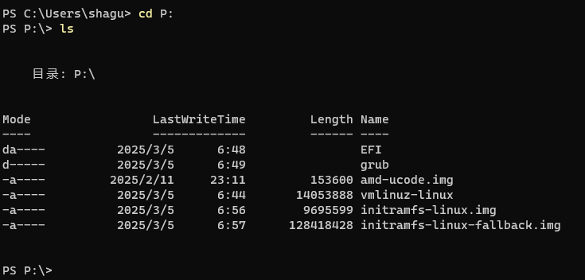

> 本篇 blog 为安装 Windows11 和 ArchLinux 双系统时对于, EFI 分区挂如何挂载问题的记录, 系统的安装顺序是先安装 Windows11 再安装 ArchLinux, 并且两个系统安装在同一个硬盘上, Arch 的引导方式为 Grub

<!-- more -->

## 写在前面话

由于我先安装的 Windows11 并且一开始没有仔细考虑, 后面需要安装 Arch 这件事情, 所以对于我来说, 安装好的 Windows11 的 EFIsystem 分区大小只有默认的 100mb. 如果你此时只有一个硬盘, 并且已经确定需要先安装 Win 再安装 Arch, 可以参考官方链接 [Arch+Windows双系统](https://wiki.archlinuxcn.org/zh-hans/Arch_%2B_Windows_%E5%8F%8C%E7%B3%BB%E7%BB%9F) 的第 2.3.5 小结, 在安装 Win 的时候可以将系统的 EFI 分区手动分大一点, 比如 1G, 那么按照网上的任何教程, 不管是将 efi 分区挂载在 `/mnt/boot/` 下, 还是在 `/mnt/efi` 下都没有问题, 因为 EFI 分区足够大, 但是如果的 Win 已经下好, 并且你不想重装系统, 那么可以参考一下下面的内容. 前面部分讲的是为什么, 如果希望直接看结果, 可以跳到最后

## 关于 Win 下的 EFI 分区的目录结构

想要查看 Win 下 EFI 分区的目录结构, 可以使用 Win 自带的 `diskpart` 工具[^1]

使用管理员权限打开 Win 的终端: 右键启动图标, 可以看到圈出来的终端管理员


输入命令

```bash
diskpart
```

进入 `distpart` 工具, 然后输入

```bash
list disk
```

查询硬盘信息, 找到 Win 的系统盘所在磁盘(可以根据所列出来磁盘的大小判断), 输入命令

```bash
select disk 0 # 这里我的输出只有一个磁盘, 如果不一样请改成自己的
```

此时进入编号为 0 的磁盘, 然后输入

```bash
list partition
```

可以看到第一个磁盘里有几个分区, 找到类型为 "系统" 的分区, 看到大小为 100MB, 找到这个分区的编号(我的编号是 1 如果不一样请自行调整), 输入

```bash
select partition 1
```

此时就进入了系统分区, 我们需要将这个分区在 win 里显示出来, 可以使用 `assign` 命令给这个分区分配一个盘符: 

```bash
assign letter = p

# 如果需要移除这个挂载的分区可以使用
remove letter = p
# 然后使用下属命令可以推退出程序
exit
```

此时你如果打开文件资源管理器, 可以发现多了一个大小为 100MB 的新的磁盘, 我们此时使用命令行对盘符 P 使用 `tree` 命令, 可以看到此时的 EFI 分区的结构: 

```bash
PS P:> tree  
卷 SYSTEM 的文件夹 PATH 列表  
卷序列号为 FE73-D850  
P:.  
EFI  
├─Microsoft  
│ ├─Boot  
│ │ ├─bg-BG  
│ │ ├─CIPolicies  
│ │ │ └─Active  
│ │ ├─cs-CZ  
│ │ ├─da-DK  
│ │ ├─de-DE  
│ │ ├─el-GR  
│ │ ├─en-GB  
│ │ ├─en-US  
│ │ ├─...  
│ │ ├─zh-CN  
│ │ ├─zh-TW  
│ │ ├─Fonts  
│ │ └─Resources  
│ │ ├─en-US  
│ │ └─zh-CN  
│ └─Recovery  
└─Boot

```

此时 P 盘里有一个叫做 EFI 的文件夹, 下面有两个文件夹, Microsoft 和 Boot, 其中 Microsoft包含了 Win 启动时引导系统可能用到的所有资源, 而 Boot 文件夹下只有一个文件 `bootx64.efi` 这个文件是 EFIsystem 的默认存放引导文件的路径, 此时存放的 efi 文件和 Microsoft 文件夹下存放的 win 启动的 efi 文件时一样的, 此时 Boot 文件夹下存放的 efi 文件是 Windows 的后备启动文件

如果你将 Arch 的 EFI 分区挂载在 `/mnt/boot` 节点上, 并且直接挂载在 Win 的 EFI 分区上, 则在安装 Arch 的基本系统的时候, 会出现 EFI 分区空间不够的情况, 导致安装失败.

## 将 Arch 的 EFI 分区挂载在 `/mnt/boot` 节点上会发生什么

经过我的测试, 在安装 Win 的时候主动给 EFI 分区分了 1G, 采用上述挂载方式, 并且配置引导时使用的命令为: 

```bash
grub-install --target=x86_64-efi --efi-directory=/boot --bootloader-id=grub
```

完全安装完成, EFI 分区的占用情况为 180MB 左右, 并且此时 EFI 分区的目录结构变成了下述的情况

```bash
PS P:\> tree
卷 SYSTEM 的文件夹 PATH 列表
卷序列号为 FE73-D850
P:.
├─EFI
│  ├─Microsoft
│  │  ├─Boot
│  │  │  ├─bg-BG
│  │  │  ├─CIPolicies
│  │  │  │  └─Active
│  │  │  ├─cs-CZ
│  │  │  ├─da-DK
│  │  │  ├─de-DE
│  │  │  ├─el-GR
│  │  │  ├─en-GB
│  │  │  ├─en-US
│  │  │  ├─...
│  │  │  ├─zh-CN
│  │  │  ├─zh-TW
│  │  │  ├─Fonts
│  │  │  └─Resources
│  │  │      ├─en-US
│  │  │      └─zh-CN
│  │  └─Recovery
│  ├─Boot
│  └─grub
└─grub
    ├─x86_64-efi
    ├─locale
    ├─themes
    │  └─starfield
    └─fonts
```

可以发现, EFI 分区的顶层变成了两个文件夹, EFI 和 grub 这两个文件夹, EFI 文件夹里还多出了一个 grub 文件夹(这个文件夹的命名是在配置引得的时候指定的, 在上述的命令里我有用到 `--bootloader-id=grub` 这个参数), 在顶层目录使用 `ls` 命令还可以发现, 顶层目录还多了 4 个文件: 



这些多出来的文件多数都是 Arch 的内核文件, 因为 `/mnt/boot` 这个节点下本来存放的是 Arch 的内核文件, 此时将这个节点挂载在 Win 的 EFI 分区, 就会将 Arch 的内核文件全部存放到 EFI 分区里, 但其实这么多文件夹里, 唯一起到引导系统作用的是 `EFI/grub/bootx64.efi` 这个文件, 这个文件其实很小, 所以我们可以通过合理的挂载方式, 防止 Arch 的内核文件放到 EFI 分区

## 将 Arch 的 EFI 分区挂载在 `/mnt/efi` 节点上

这里的参考思路来自, 引用的第二篇博客[^2]

此时我们将 Arch 的 EFI 分区挂载在 `/mnt/efi` 节点上, 并且挂载到 Win 的 EFI 分区

使用的生成引导文件的命令为: 

```bash
grub-install --target=x86_64-efi --efi-directory=/efi --bootloader-id=arch
```

查看 EFI 分区的目录结构如下: 

```bash
PS P:> tree  
卷 SYSTEM 的文件夹 PATH 列表  
卷序列号为 FE73-D850  
P:.  
EFI  
├─Microsoft  
│ ├─Boot  
│ │ ├─bg-BG  
│ │ ├─CIPolicies  
│ │ │ └─Active  
│ │ ├─cs-CZ  
│ │ ├─da-DK  
│ │ ├─de-DE  
│ │ ├─el-GR  
│ │ ├─en-GB  
│ │ ├─en-US  
│ │ ├─...  
│ │ ├─zh-CN  
│ │ ├─zh-TW  
│ │ ├─Fonts  
│ │ └─Resources  
│ │ ├─en-US  
│ │ └─zh-CN  
│ └─Recovery  
├─Boot
└─arch
```

发现此时的目录结构和最开始安装好 Win 之后的目录结构相比就是在 EFI 文件夹下多了一个 arch 文件夹, 此时这个文件夹下只有一个文件: `bootx64.efi` 这个文件就是用于引导 Arch 的文件, 并且整体的 EFI 分区的占用情况和只安装了 Win 的情况几乎一样

注意: 这里我没有使用原博客里的 `--removable` 参数, 因为使用了这个参数, 会将生成的 `bootx64.efi` 文件直接覆盖掉 `EFI/Boot/bootx64.efi` 而不是在一个新建的文件夹下生成一个, 这样做的风险是会覆盖掉 Win 引导文件的备份, 可能会出现一些意外的情况

## 参考文献

[^1]: [https://blog.csdn.net/mtllyb/article/details/78635757](https://blog.csdn.net/mtllyb/article/details/78635757)

[^2]: [https://yoimiyalove.top/2024/08/25/efi](https://yoimiyalove.top/2024/08/25/efi)
