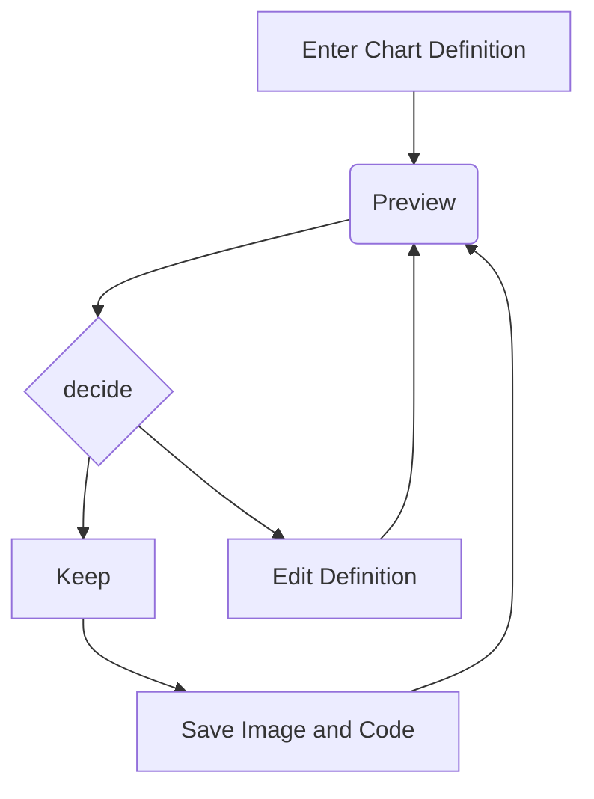

> 本文件为测试显示是否正常使用

<!-- more -->

公式块测试: 

$$
y = ax + b
$$

行级公式测试: $y = kx$

---

代码块测试: 

```cpp
#include <iostream>
int main()
{
	return 0;
}
```

行级代码测试: `#include`

---

mermaid测试: 



---

表格测试: 

| 1   | 2   |
| --- | --- |
| 3   | 4   |


